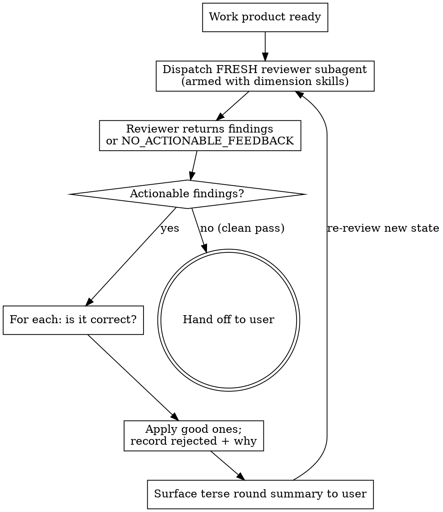

# Reviewing work in a loop

## Overview

Before handing a plan or code back to the user, iterate an independent review to
convergence: dispatch a **fresh reviewer subagent**, absorb its findings, apply
the good ones, then dispatch **another fresh reviewer** on the new state. Repeat
until a reviewer returns no actionable feedback. Only then hand off.

**Core principle:** one review round is not enough. A single pass catches the
first layer; your fixes introduce a second layer; convergence is a *clean pass by
a reviewer who has never seen the earlier rounds*, not "I think it's fine now."

This composes with a one-shot code-review skill (e.g. superpowers'
`requesting-code-review`), if you have one installed (that skill = how to
dispatch one review; this skill = how many, and when to stop). This skill does
not replace it.

## When to use

- About to say "ready for your review" / "here's the plan" to the user.
- The user says "review your work" / "make sure it's good before showing me".
- Finished a feature, bugfix, or refactor and are about to present it.
- Finished a plan draft and are about to present it.

**Do NOT use for:** trivial one-line/typo/mechanical changes where an outside
reviewer adds nothing, or when the user explicitly said "just show me the raw draft".

## The loop

### 1. Dispatch a fresh reviewer each round

New subagent every round. It reviews the **current state cold** - do not feed it
prior rounds' findings or your reasoning. Bias-free convergence depends on each
reviewer judging the artifact as-is, not grading your homework.

Arm it with the right standards for the artifact:

- **Always:** tell it to check the work against the acceptance criteria /
  original ask you give it.
- **Personal / global standards:** if you have a personal or global code-style
  skill installed (e.g. an `applying-*-code-style` skill in your user skills
  dir), tell the reviewer to apply it - it travels with you across every repo.
- **Repo-local standards:** before round 1, discover the current repo's own
  standards - a review or code-style skill in the repo's skills dir, a style
  guide, or conventions documented in its AGENTS.md/CLAUDE.md - and tell the
  reviewer to apply them too. Do not hardcode any one repo's skill name; discover
  it in the checkout you are working in.
- Where neither personal nor repo standards exist, the reviewer falls back to the
  general dimensions below.
- Give it: what the work is, what it must satisfy (ACs/requirements), and for
  code the base/head SHAs or the diff.

### 2. Reviewer output shape (require this)

Instruct the reviewer to return findings as, one per line:

`SEVERITY | location | problem | suggested fix`

where SEVERITY is Critical / Important / Minor. And require an explicit
termination sentinel when it has nothing actionable: the reviewer must end with a
line reading exactly `NO_ACTIONABLE_FEEDBACK` when there are zero Critical/
Important findings and no Minor finding it considers worth acting on. This makes
the stop condition unambiguous - you are not guessing whether "looks good" means
done.

Review dimensions the reviewer must cover (adapt to artifact):

- Correctness / bugs / edge cases (code only).
- Acceptance-criteria / requirements match (does it do what was asked, no scope
  drift).
- Code style per your personal/global style skill and the repo's documented
  standards, if any (code only).
- Codebase fitment (consistent with surrounding patterns, reuses existing
  utilities, follows repo conventions).
- Code quality (readability, complexity, duplication, naming).
- For a **plan**: no bugs to find, so weight structure, sequencing (each step's
  precondition produced by a prior step), correctness of claims against the actual
  codebase, and completeness vs the ask.

### 3. You judge, then you apply

You (main agent) absorb the findings and decide each on merit - you are not a
rubber stamp for the reviewer. Apply the correct ones. **Reject bad suggestions**
and record why (the user wants honest assessment, not blind compliance). If a
reviewer is wrong, note the reasoning; do not "apply" a fix you believe is wrong
just to silence the round.

The reviewer subagent never edits code - it only reports. Fixing is yours, so the
judgement gate stays with you.

### 4. Re-review after every change

Any change you made -> dispatch a new fresh reviewer on the new state. Your fixes
can introduce new problems; convergence requires the *post-fix* state to pass
cleanly, judged by a reviewer that never saw the pre-fix state.

### 5. Stop condition

Stop when a fresh reviewer returns `NO_ACTIONABLE_FEEDBACK` (no Critical/Important,
no act-worthy Minor). That clean pass - not your own confidence - is the gate.

**Safety cap:** if a 4th round still surfaces substantive findings (not just
shrinking Minor nits), stop looping and surface to the user directly: the
artifact likely has a structural problem worth their call, not more polishing.

### 6. Surface each round terse, then hand off

After each round, give the user a terse summary: findings taken, findings
rejected + one-line why. Then continue the loop. On the final clean pass, hand
off. This lets the user catch a bad accept/reject mid-loop.

## Quick reference

| Step | Do |
|---|---|
| Reviewer | Fresh subagent each round, cold on current state |
| Arm with | your personal/global style skill + the repo's own review/style standards (if any) + the ACs |
| Output | `SEVERITY \| location \| problem \| fix`, ending `NO_ACTIONABLE_FEEDBACK` when clean |
| Apply | You judge each; apply good, reject bad with reason; reviewer never edits |
| Re-review | After ANY change, new fresh reviewer on new state |
| Stop | A round returns `NO_ACTIONABLE_FEEDBACK` (or 4-round safety cap -> surface to the user) |
| Surface | Terse per-round (taken/rejected + why), then hand off on clean pass |

## Red flags - STOP

| Thought | Reality |
|---|---|
| "I self-reviewed thoroughly, an outside round is overkill" | Self-review misses your own blind spots - that's the whole reason for an outside reviewer. Run the round. |
| "One review came back clean-ish, hand off" | One round only vets the pre-fix state. If you changed anything, re-review. Clean = a fresh reviewer on the final state. |
| "It's simple / I'm confident / looks fine" | Confidence is not evidence. "Looks fine" is exactly what an outside check exists to override. |
| "Reviewer flagged Minor stuff, close enough" | Either act on it or have the reviewer mark it non-actionable. The stop signal is `NO_ACTIONABLE_FEEDBACK`, not your read of "close enough". |
| "The user is waiting, skip the loop to be fast" | Handing over unvetted work costs more of their time than a couple of rounds. Loop first. |
| "I'll feed the reviewer what the last round said so it's efficient" | That biases it into grading your fixes. Fresh + cold each round. |
| "The reviewer said X, I'll just apply it" | You judge merit first. Reject wrong findings with a reason; don't rubber-stamp. |
| "It's still churning after several rounds, keep going" | Past the safety cap, churn signals a structural problem - surface to the user, don't polish forever. |

## Maintaining this skill

Test provenance: baseline (RED) with two agents about to hand off a plan and code
showed the default is **self-review-and-ship** (plan agent: "left to my defaults I
would NOT spawn an independent critique") and, when a review was run, **a single
round** with a fuzzy stop ("no unaddressed Critical/Important" / "only nitpicks"),
and the reviewer was not armed with the dimension standards. Rationalizations
captured verbatim: "it's simple", "I'm confident", "just this once", "seems
solid", "outside critique is overkill", "the user is waiting". This skill counters
each: mandatory loop, fresh cold reviewer per round armed with the review
dimensions, an unambiguous `NO_ACTIONABLE_FEEDBACK` stop sentinel, and a red-flags
table naming those exact rationalizations.
